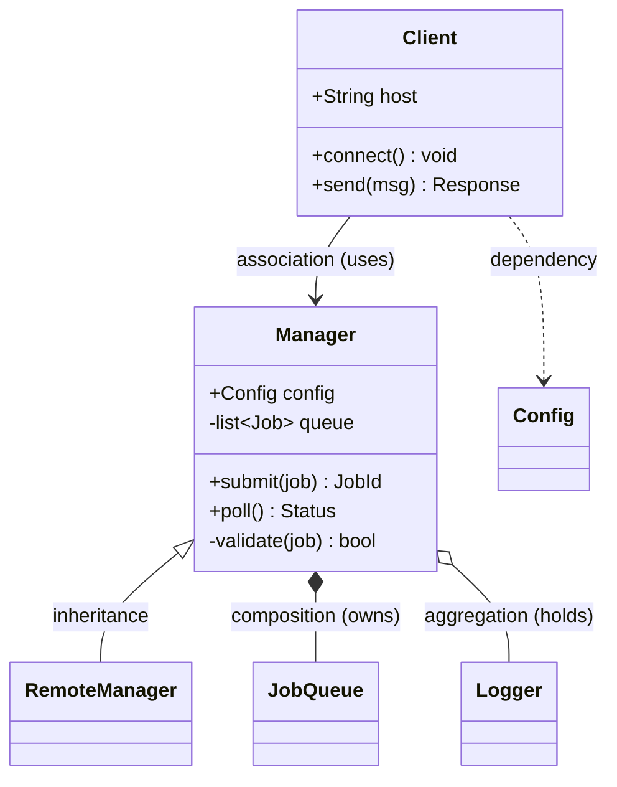
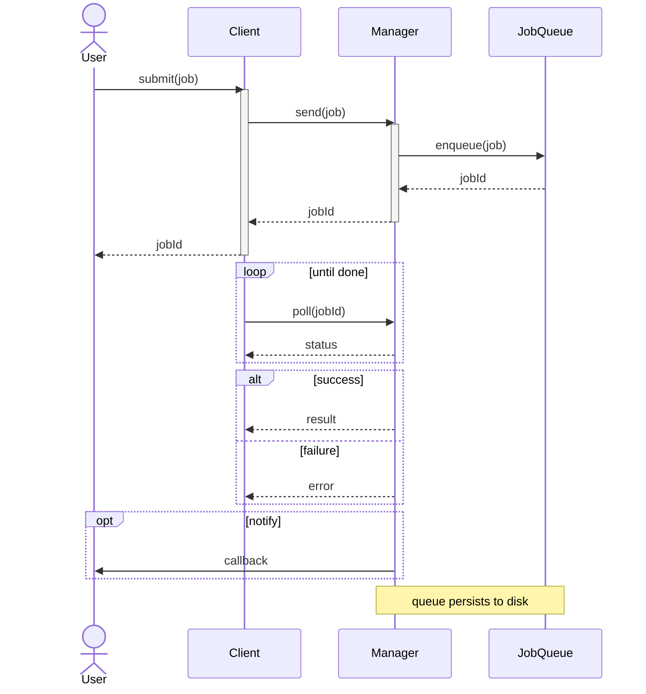
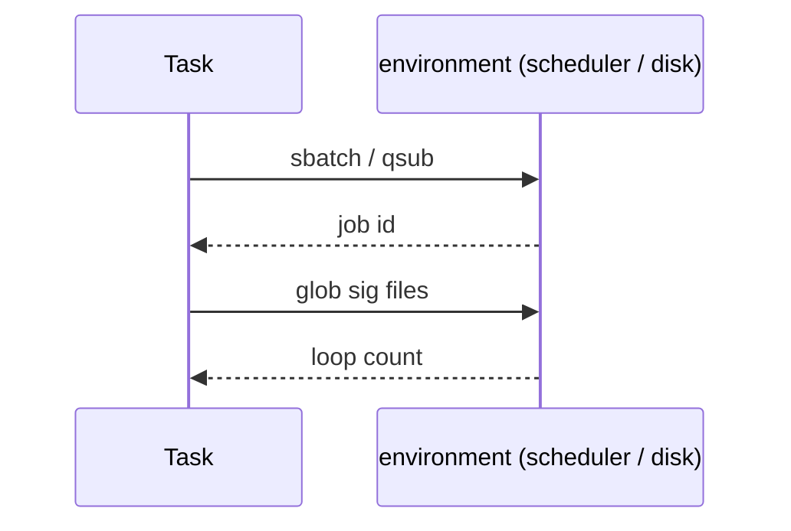
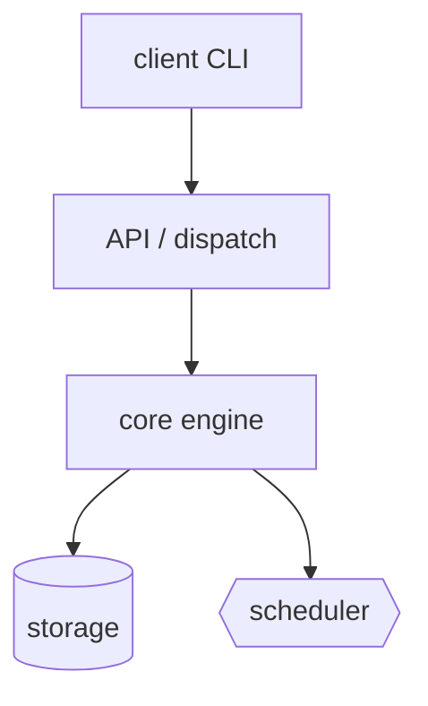

# Mermaid syntax for reverse-engineering reports

Quick reference for the two diagram types this skill emits. Mermaid is
whitespace- and punctuation-sensitive; most "diagram won't render" failures come
from the gotchas at the bottom. Skim those before you ship.

## Class diagram

Member syntax inside a `class` block:

- Visibility prefix: `+` public, `-` private, `#` protected, `~` package.
- Attribute: `+Type name` or `+name Type` (be consistent).
- Method: `+name(params) ReturnType` — the `()` is what marks it a method.
- Static member: trailing `$` (`+count()$ int`). Abstract: trailing `*`.
- Generics use tildes, not angle brackets: `List~Job~`, `Map~String, int~`.

Relationship arrows (left is the "source"):

| Arrow | Meaning |
|---|---|
| `A <|-- B` | B inherits from A |
| `A *-- B` | A is composed of B (A owns B's lifetime) |
| `A o-- B` | A aggregates B (holds a reference) |
| `A --> B` | A is associated with / uses B |
| `A ..> B` | A depends on B (transient/parameter) |
| `A ..|> B` | A realizes/implements interface B |

Add cardinality and labels with quotes:
`Manager "1" *-- "many" Job : schedules`.

## Sequence (interaction) diagram

Arrows and constructs:

- `->>` solid arrowhead = synchronous call; `-->>` dashed = return/response.
- `-)` open arrowhead = async/fire-and-forget.
- `activate` / `deactivate` (or `->>+` / `-->>-` shorthand) draw lifelines.
- Grouping: `loop … end`, `alt … else … end`, `opt … end`, `par … and … end`,
  `critical … end`, `break … end`.
- Compress a long diagram: wrap a phase in `rect rgb(235,235,235) … end` with a
  `Note` to label it, or collapse a whole sub-flow into a single arrow with a
  summarizing label (`M->>T: run tick (poll + act)`). Keep the expansion for the
  detail file.
- `Note over A,B: text`, `Note left of A: text`, `Note right of A: text`.
- Declare participants up front to control left-to-right order; `as` gives a
  short alias for a long name.
- **A lifeline is an object or a process — not a method, a module, or the outside
  world.** Columns are class instances and the distinct processes/actors of the
  system you're mapping. A method call is an arrow or a self-message
  (`T->>T: submit()`), never a column. A free-function module in the same process
  (e.g. `scheduler_layer`) is a self-message on its caller, not a participant.
  Everything outside your system — the scheduler, a DB, the filesystem, the OS —
  collapses into a single `environment` column (see below), never a lane per
  external thing.
- **Prune low-traffic lifelines.** A participant with only one or two arrows (a
  `User` who just kicks off and reads the final reply) usually isn't worth a
  column — fold it into a `Note` or start the flow at the first real component.

## The outside world: one "environment" column

Mermaid has **no lost/found messages** — you can't draw an arrow into empty
space, and a transient `create`/`destroy` node per call just litters the diagram.
So collapse everything outside your system — OS, filesystem, scheduler, database,
remote services — into a *single* `environment` participant, and route every
boundary-crossing call to it with the command named on the arrow:

One env column keeps every boundary visible while costing exactly one lane. Give
the environment more than one lane only when the protocol *between* specific
external systems is the whole point of the diagram. A human operator is **not**
the environment — if the user earns a lifeline, keep it as its own `actor`,
separate from `environment`.

## Component / system-map diagram (flowchart)

For a large project's **system map**, draw subsystems as nodes and their
dependencies/calls as edges with a flowchart — not a class or sequence diagram:

- `flowchart TD` (top-down) or `LR` (left-right) sets direction.
- Node shapes carry meaning: `id[rect]` service, `id([stadium])` entry point,
  `id[(database)]` store, `id{{hexagon}}` external system, `id{diamond}` decision.
- Edges: `-->` solid, `-.->` dotted, `==>` thick; label with `-->|text|` or
  `A -- text --> B`.
- `subgraph Name … end` groups nodes into a bounded box (a layer or bigger
  subsystem).
- One node per subsystem, ~7±2 nodes. Classes inside a subsystem belong in that
  subsystem's overview, not the map.

## Common gotchas (these break rendering)

- **Reserved word `end`** as a node/participant id breaks the parser. Capitalize
  or rename (`End`, `endNode`).
- **Angle brackets / generics**: use `~T~`, never `<T>`, inside class diagrams.
- **Parentheses or special chars in labels**: wrap the text in quotes, e.g.
  `C->>M: "call f(x)"`. Bare `()` in a sequence message is usually fine, but `:`,
  `;`, and `#` in labels are not — quote them.
- **Notes need a target**: `Note: text` alone is invalid; use `Note over X: text`.
- **Every `activate` needs a matching `deactivate`** (or use the `+`/`-`
  shorthand consistently) or the lifelines render wrong.
- **Blank diagram body**: a `classDiagram` or `sequenceDiagram` header with no
  valid statements renders as an error box — make sure content followed.
- **Comments** start with `%%` on their own line.
- Keep one statement per line; mermaid does not like multiple arrows on a line.
